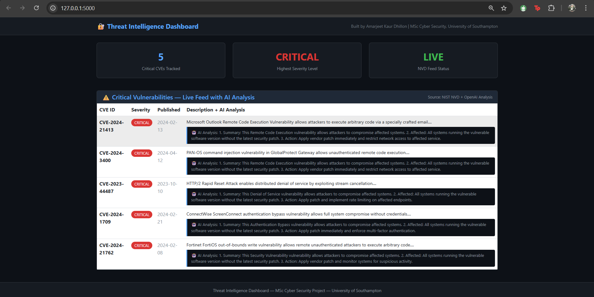

 AI-Powered Threat Intelligence Dashboard

A cybersecurity dashboard that fetches live critical CVEs from the NIST National Vulnerability Database and provides automated security analysis for each vulnerability.

Built as part of MSc Cyber Security — University of Southampton.

 Features
- Live CVE feed from NIST NVD API
- Automated security analysis for each vulnerability
- Severity classification (Critical/High/Medium/Low)
- Remediation recommendations
- Clean dark-themed web dashboard
- Fallback data system for API rate limits

 Tech Stack
- Python 3.14
- Flask (web framework)
- NIST NVD API (CVE data)
- Bootstrap 5 (frontend styling)

 How to Run

 1. Clone the repository
git clone https://github.com/AmarjeetkaurDhillon/threat-intel-dashboard.git
cd threat-intel-dashboard

 2. Create virtual environment
python -m venv venv
venv\Scripts\activate

 3. Install dependencies
pip install -r requirements.txt

 4. Create .env file
Create a file called .env and add:
NVD_API_KEY=your_nvd_api_key_here

 5. Run the app
python app.py

 6. Open in browser
Go to http://127.0.0.1:5000

 Project Structure
```
threat-intel-dashboard/
├── app.py              # Flask application
├── fetch_nvd.py        # NVD API integration
├── summariser.py       # Security analysis engine
├── requirements.txt    # Dependencies
├── templates/
│   └── index.html      # Dashboard UI
└── .env                # API keys (not committed)
```

 Author
Amarjeet Kaur Dhillon  
MSc Cyber Security — University of Southampton  
dhillonamarjeetkaur207@gmail.com  
GitHub: https://github.com/AmarjeetkaurDhillon